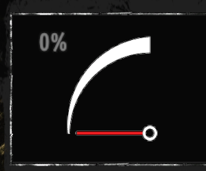
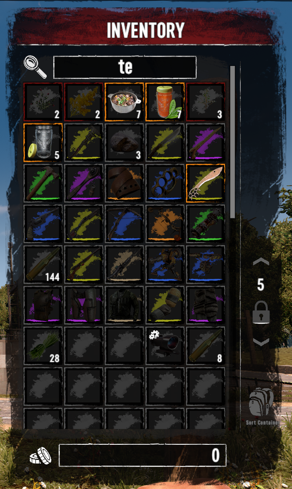

# Using the new Controllers in your mod

Once XUiComponents is added to your mod as shown in the [README.md](../README.md),
you can start using the new controllers in your mod.

## The Controllers

* [`XUiC.Spinner`](#XUiC.Spinner) spins the widget that it is attached to
* [`XUiC.DialIndicator`](#XUiC.DialIndicator) makes the widget that it is attached to act like a dial indicator, useful to make a speedometer or
fuel tank gauge
* [`XUiC.ItemStack`](#XUiC.ItemStack) an updated `ItemStack` controller that includes some additional bindings and features
* [`XUiC.Backpack`](#XUiC.Backpack) an updated `Backpack` controller that includes new features like search
* [`XUiC.LootContainer`](#XUiC.LootContainer) an updated `LootContainer` controller that includes new features like search
* [`XUiC.VehicleContainer`](#XUiC.VehicleContainer) an updated `VehicleContainer` controller that includes new features like search
* [`XUiC.MapInvitesListEntry`](#XUiC.MapInvitesListEntry) an updated `MapInvitesListEntry` controller that includes new bindings
* [`XUiC.MapWaypointListEntry`](#XUiC.MapWaypointListEntry) an updated `MapWaypointListEntry` controller that includes new bindings

## Add the controller in XML

In the widget that will use the controller, add the following line

```XML
<Widget
    ...
    controller="XUiC.{Name of the controller}, XUiComponents"
    ...
/>
```

### Example

For example, to use `XUiC.Spinner`, the xml will look like the following

```XML
<Widget
    ...
    controller="XUiC.Spinner, XUiComponents"
    ...
/>
```

Some controllers have additional attributes that is added to the widget that has the controller attached

## XUiC.Spinner

<p align="center" width="100%">
     <br>
    The Spinner being used in SMXhud to show the player having an available skill
    point
</p>

### Using the Spinner Controller

The controller is added to the widget that is to be spun by the controller

```XML
<Widget
    ...
    controller="XUiC.Spinner, XUiComponents"
    
    spin="true|false" - True if the Spinner should be actively spinning

    angle_per_second="float" - The how fast of an angle in degrees the widget should 
            spin per second. A positive number spins the widget in a counter clockwise 
            direction, while a negative number spins the widget in a clockwise direction
    ...
/>
```

## XUiC.DialIndicator

<p align="center" width="100%">
     <br>
    The Dial Indicator being used in SMXui as a fuel gauge in the vehicle screen
</p>

### Using the Dial Indicator Controller

The controller is added to the widget that is to be moved by the controller. The controller will handle the animation
and calculating where the indicator should be based on its current value and min and max range and their angles.

```XML
<Widget
    ...
    controller="XUiC.DialIndicator, XUiComponents"

    indicator_value="float" - The current value of the indicator

    start_angle="float" - The angle in degrees of the dial for when the indicator value is equal to the range_min

    end_angle="float" - The angle in degrees of the dial for when the indicator value is equal to the range_max

    range_min="float" - The minimum value represented by the indicator

    range_max="float"  - The maximum value represented by the indicator

    limit_indicator_to_range="true|false" - if the indicator is to be bound to the min and max range values. If true 
        the indicator will not move beyond the start and end angle if the indicator value is outside those ranges 

    animation_duration="float" - An estimate of how long the animation should take from changing from a previous value to
        a new value. If the indicator value has changed during the animation, the animation time will reset with the
        animation starting from the position it was in before the new indicator value.

    ...
/>
```

Notes:

* The angles here are using Unity's rotation system.
* To have the indicator to go from right to left, add negatives to the range values and the indicator value

## XUiC.ItemStack

This controller is an extension of the vanilla `ItemStack` controller. Some of the features of the `XUiC.ItemStack`
requires the use of the `XUiC.Backpack`, `XUiC.LootContainer`, or `XUiC.VehicleContainer` controllers. Those controllers
need to be attached as a controller to a parent widget of the widget containing the `XUiC.ItemStack` controller.

The `XUiC.ItemStack` controller when used in conjuction of the controllers mentioned above, are as followed:

* Showing if the `ItemStack` is locked when using the inventory locking system in 7 Days to Die
* Showing if the `ItemStack` is found or not in a search result.

### Using the ItemStack Controller

```XML
<Widget
    ...
    controller="XUiC.ItemStack, XUiComponents"
    lockedslot_color="color" - The color of that is returned to the {selectionbordercolor} binding if the slot is 
        locked

    search_color="color" - The color of that is returned to the {selectionbordercolor} binding if the slot contains
        an item that matches the search 

    nomatch_iconcolor="color" - The color that is returned to the {iconcolor} binding if the slot contains an item 
        that does not match the search. Also is used to tint the {durabilitycolor} of the item if in the slot has a
        durabilitycolor

    ...
/>
```

All those new attributes do not need to be set and only show up if they are set for that controller. The priority of
the color being returned in the {selectionbordercolor} binding is as followed

```text
 select_color > highlight_color > holding_color > search_color > lockedslot_color > background_color
```

So if the item is in a locked slot and the player selects the slot, the select_color color will be returned from the
{selectionbordercolor} instead of the lockedslot_color color.

### Additional ItemStack Bindings

XML Binding | Description
---------|----------
`{isempty}`                         | Is the slot empty
`{isalockedslot}`                   | Is the ItemStack a locked slot
`{issearchactive}`                  | Is there an active search going on by the player
`{matchessearch}`                   | Does the item in this slot matches the search by the player
`{itemql}`                          | The item's quality level. Returns "" if the item does not have durability
`{stackcount}`                      | How how many items are in the stack. Returns "" if the item has durability

## XUiC.Backpack

<p align="center" width="100%">
     <br>
    XUiC.Backpack being used in SMXui to show players which slots are <br>
    locked and what items match their search in their inventory
</p>

This controller is an extension of the vanilla `Backpack` controller. Both the Search and Slot locking features require
the child `ItemStack` controllers to be replaced with `XUiC.ItemStack`.

### Using the Backpack Controller

```XML
<Widget
    ...
    controller="XUiC.Backpack, XUiComponents"
    ...
>
```

#### Locked Slots

7 Days to Die has a inventory locking feature that is disabled in the vanilla UI. To enable the inventory locking,
a combobox with the `ComboBoxInt` controller has to be within the same window. The `XUiC.Backpack` controller will
use the first found widget with a `ComboBoxInt` controller attached to it.

#### Inventory Search

To enable the inventory search, a widget with the `TextInput` controller has to be within the same window. It is possible to
use the vanilla `textfield` controls as the widget with the `TextInput` controller. The `XUiC.Backpack` controller will
use the first found widget with a `TextInput` controller attached to it.

## XUiC.LootContainer

This controller is an extension of the vanilla `LootContainer` controller. Both the Search and Slot locking features require the child ItemStack controllers to be `XUiC.ItemStack`.

### Using the LootContainer Controller

The usage is the same as the [`XUiC.Backpack`](#Using-the-Backpack-Controller)

```XML
<Widget
    ...
    controller="XUiC.LootContainer, XUiComponents"
    ...
>
```

## XUiC.VehicleContainer

This controller is an extension of the vanilla `VehicleContainer` controller. Both the Search and Slot locking features require the child ItemStack controllers to be `XUiC.ItemStack`.

### Using the VehicleContainer Controller

The usage is the same as the [`XUiC.Backpack`](#Using-the-Backpack-Controller)

```XML
<Widget
    ...
    controller="XUiC.VehicleContainer, XUiComponents"
    ...
>
```

## XUiC.MapInvitesListEntry

This controller is an extension of the vanilla `MapInvitesListEntry` controller.

### Using the MapInvitesListEntry Controller

```XML
<Widget
    ...
    controller="XUiC.MapInvitesListEntry, XUiComponents"
    ...
>
```

### Additional MapInvitesListEntry Bindings

XML Binding | Description
---------|----------
`{isempty}`                         | Is the entry empty

## XUiC.MapWaypointListEntry

This controller is an extension of the vanilla `MapWaypointListEntry` controller.

### Using the MapWaypointListEntry Controller

```XML
<Widget
    ...
    controller="XUiC.MapWaypointListEntry, XUiComponents"
    ...
>
```

### Additional MapWaypointListEntry Bindings

XML Binding | Description
---------|----------
`{isempty}`                         | Is the entry empty
