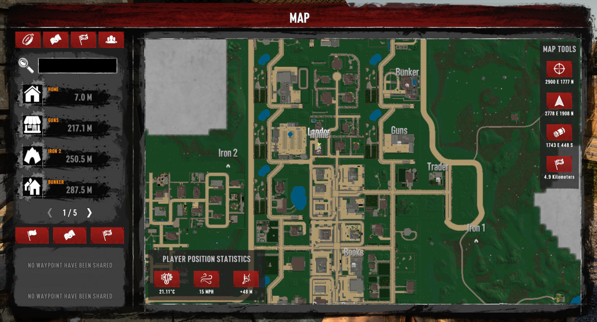

# Using the patched vanilla widgets in your mod

Once XUiComponents is added to your mod as shown in the [README.md](../README.md),
you can start using the patched vanilla widgets and controllers in your mod.

With the Harmony patching, there is no additional set up to be able to use the patched vanilla widgets.

## Map View Texture

<p align="center" width="100%">
     <br>
    A curved label displayed in game
</p>

The `texture` widget with the name `mapViewTexture` used with the `MapArea` controller in vanilla is locked to a 1:1 aspect
ratio and ba set size of 712 by 712.

With XUiComponents, the hardcoded 712 by 712 size is removed and allows an aspect ratio that is not 1:1.

### Usage of Map View Texture

```XML
<texture 
    depth="2" 
    name="mapViewTexture"
    width="1920" - This can be any different width
    height="1080" - This can by any different height
    pos="0,0" 
    material="Materials/MaskableMainmap" />
```
