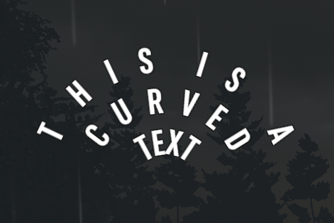
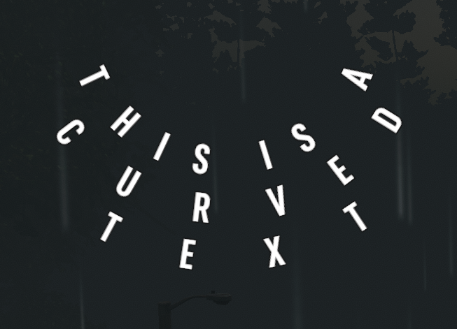

# Using the new Widgets in your mod

Once XUiComponents is added to your mod as shown in the [README.md](../README.md),
you can start using the new widgets in your mod.

## The Widgets

* [`curvedlabel`](#Curved-Label) A label that curves the text
* [`scrollview`](#ScrollView) A widget container that is scrollable
* [`scrollbar`](#Scrollbar) A scrollbar that is usable with the `scrollview` to scroll the `scrollview`

## Overview on using the Widgets

The widgets in XUiComponents are added to the UI the same way as vanilla UI widgets. Each widget is an
individual xml element that can be added to the XUi xml files.

## Curved Label

<p align="center" width="100%">
     <br>
    A curved label displayed in game
</p>

The Curved Label is an extension of the Label widget that allows text to be curved around a central point.

### Using the Curved Label

The widget is added the same way as other widgets, where it is defined in the xml as its own element.

```XML
<curvedlabel
    ...
    radius="float" - The radius from the center point to place the first line of text

    arc_degrees="float" - How much the text should curve around the center point

    angular_offset="float" - The offset to rotate the text

    max_degrees_per_letter="integer" - The max spacing between the letters based on degrees

    flip="true|false" - If the first line should be at top line or bottom line, 
        default is false

    draw_outwards="true|false" - If the text should be placed going towards the center point or away from the center point,
        default is false

    justify="left|right|center" - Where the text should justify towards. If left, the text will expand clockwise, right, the
        text will expand counter clockwise, center the text will expand in both directions
    ...
/>
```

<p align="center" width="100%">
     <br>
    A curved label displayed in game with <br>
    flip="true" and draw_outwards="true"
</p>

## ScrollView

The Scroll View is a new widget that creates a scrollable viewport for widgets that are children of the `scrollview`. It can
be used in tandem with the `scrollbar`. A player can scroll the `scrollview` by hovering their mouse over the `scrollview`
and using the scroll wheel on their mouse. If a `scrollbar` is attached to the `scrollview` it can be used to scroll the
`scrollview`. See [`scrollbar`](#scrollbar) to see how to add a `scrollbar` to the `scrollview`.

### Using the ScrollView

<p align="center" width="100%">
     <br>
    The player's backpack using the scrollview in the SMXui <br>
    ZMXuiCPPBM addon
</p>


The `scrollview` allows child widgets inside of it. All child widgets inside the `scrollview` will be clipped to the
size of the `scrollview`.

 Adding the `scrollview` to the XUi xml :

```XML
<scrollview ...>
    <childWidget ...>
    <childWidget ...>
    ...
</scrollview>
```

#### ScrollView Attributes

```XML
<scrollview
    ...
    reset_position="true|false" - Resets the position of the content in the scrollview when the window containing the
        scrollview is opened
        default is false

    over_scroll="true|false" - Allows the player to scroll past the bounds of the content in the scrollview, 
        clipping is set to SoftClip or ConstrainButDontClip, an animation will move the scrollview 
        content back into view after the player stops scrolling
        default is false

    scroll_speed="float" - How fast the scroll wheel is at scrolling
        default is 2.5

    scroll_direction="Horizontal|Vertical" - The scrolling direction
        default is Vertical

    clipping="None|SoftClip|ConstrainButDontClip" - How the scrollview will clip the the child widgets outside the 
        bounds of scrollview. None allows infinite scrolling. SoftClip will clip the child widgets. ConstrainButDontClip 
        will not allow infinite scrolling but will not clip child widgets outside the bounds of the scrollview
        default is SoftClip

    clippingsoftness="float, float" - The distance of the clipping fade when clipping is set to SoftClip
        default is 0,0
    ...
>
```

## Scrollbar

<p align="center" width="100%">
     <br>
    The player's backpack using the scrollview with a scrollbar <br>
    in the SMXui ZMXuiCPPBM addon
</p>

The Scrollbar is a new widget to be used in tandem with the `scrollview` widget. It is the widget that is the scrollbar
for the `scrollview`. The `scrollbar` consists of two parts, the handle(foreground) and the background. The handle allow
the player to scroll the `scrollview` when clicked on and moved. If the player clicks on the background, the handle will
automatically scroll the `scrollview` along with itself to the position clicked.

### Using the Scrollbar

The `scrollbar` has two ways to create it in the XUi xml. The `scrollbar` allows two child widgets that can either be
a sprite widget or a button widget, this allows additional customization of the scrollbar. The `scrollbar` itself does
require a name. The background of the `scrollbar` is not required, but the handle is required

Without the child Widgets:

```XML
<scrollbar name="" .../>
```

With the child Widgets:

```XML
<scrollbar name="" ...>
    <sprite .../> or <button .../>
    <sprite .../> or <button .../>
</scrollbar>
```

Once the `scrollbar` is added to the XUi xml, the `scrollview` has to have the `scrollbar` attached to it. This is
done by adding an attribute to the `scrollview` referencing the name of the `scrollbar` to be used.

```XML
<scrollview 
    ...
    scrollbar="{Name of the Scrollbar}"
    ...
/>
```

#### ScrollBar Attributes

```XML
<scrollbar
    ...
    name="{Name of the Scrollbar}" - The name of the scrollbar

    foregroundname="string" - The name of the child widget that will be used for the handle

    backgroundname="string" - The name of the child widget that will be used for the background

    foregroundsprite="sprite name" - The name of the sprite in UIAtlas to use for the handle

    foregroundcolor="color" - The color of the handle sprite if the foregroundsprite is set
        default is white

    backgroundsprite="sprite name" - The name of the sprite in UIAtlas to use for the background

    backgroundcolor="color" - The color of the background sprite if backgroundsprite is set
        default is white

    padding="integer" - The padding between the bounds of the background and the handle
        default is 5.
    ...
>
```

If `foregroundname` and `backgroundname` are set, the `scrollbar` will use those child widgets over
the `foregroundsprite` and `backgroundsprite` respectly, even if those attributes are also used.

Either the `foregroundname` or the `foregroundsprite` must be set for the `scrollbar` to work properly. Both
`backgroundname` or the `backgroundsprite` are not required, but if they are not set, the clicking on the background
feature to scroll will not be available.

It is recommended if you use a `<button>` for either the handle or the background that `hoverscale` is set to 1.
