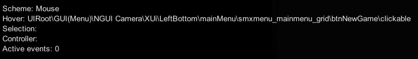

# Using the XUiC Console Commands

Once XUiComponents is added to your mod as shown in the [README.md](../README.md),
you can start using the XUiC console commands.

To open up the console, press F1 while in 7 Days to Die. This allows viewing on the
in game console. There are a few ways to turn on the XUiC Debugging with the in game console.

The initial commands available to access the sub commands are as followed:

```text
    xuic
    xuicomponents
```

Either initial command can be used.

## Sub Commands

### Debug

The debug subcommand is used to turn on or off the debug mode for XUiComponents. Debug mode includes the following :

* Logging of some messages from XUiComponents to the console and the 7D2D log file
* The NGUI UICamera debug is shown in the top left corner of the screen

<p align="center" width="100%">
     <br>
    An example of the NGUI UICamera debug
</p>

#### Usage

```text
    debug - toggles the debug mode on or off
    debug [on|off] - turns the debug mode on or off depending on if on or off is used
    debug [true|false] - turns the debug mode on if true, turns debug mode if false
    debug [1|0] - turns the debug mode on if 1, turns debug mode if 0
```

#### Example

```text
    xuic debug
```
